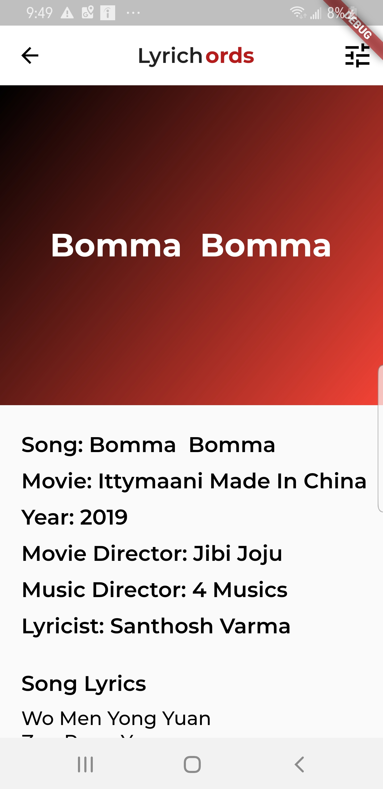

# Lyrichords v2
Lyrichords is a music library that connects with a GraphQL server to get real time music data such as lyrics, songs, etc

Here is a link to the version one: https://play.google.com/store/apps/details?id=com.lyrichords.malayalam&hl=en

The first version of this app was built using Ionic 2 and Angular 4.

## Version One Screenshots

